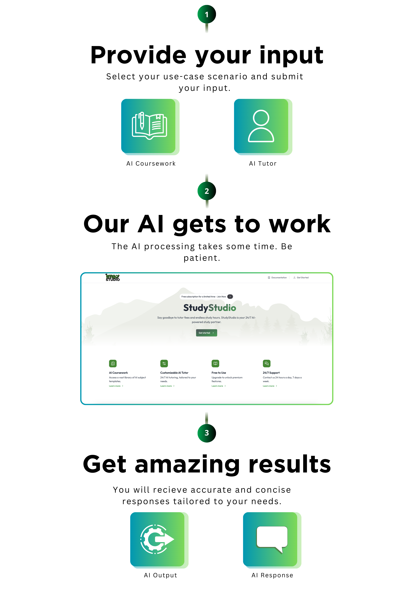

## How It Works

{/* Live demo [here](https://framecast-ai.vercel.app). */}

The app is powered by:

- 🤖 [Gemini](https://ai.google.dev/) for AI tutoring and fine-tuning
- ⚛️ [React](https://react.dev/) for user interface
- ▲ [Next.js](https://nextjs.org/) for app and landing page
- 🗄️ [Neon](https://neon.tech/) (Postgres) for database
- 🔐 [Clerk](https://clerk.com/) for authentication
- 💼 [Drizzle ORM](https://orm.drizzle.team/) for database management
- 💳 [Stripe](https://stripe.com/), [PayPal](https://www.paypal.com/), & [Razorpay](https://razorpay.com/) for billing

<figure className="mt-10">
  <></>
  <figcaption>
    A step by step process of how StudyStudio generates AI results.
  </figcaption>
</figure>
