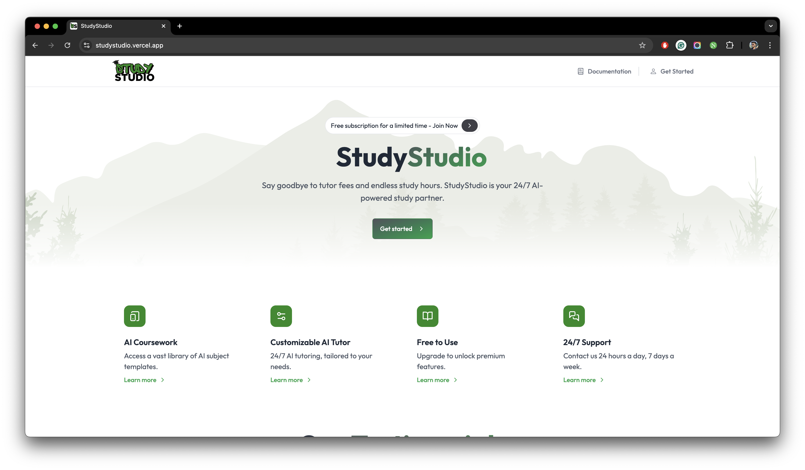
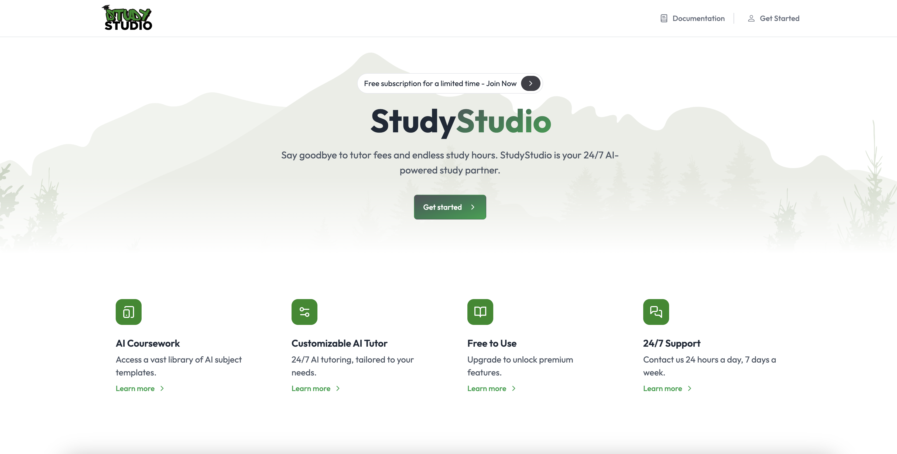

# StudyStudio

Introducing **StudyStudio**, an educational SaaS platform powered by Gemini that lets students and parents create
personalized AI tutors for any subject. With StudyStudio, say goodbye to high tutoring costs and hello to flexible,
on-demand learning. This intuitive platform makes it easy to tailor AI tutors to specific coursework needs,
allowing users to chat and learn at their own pace. Built with Next.js, React, and Gemini StudyStudio is your
ultimate tool to transform tutoring, making education accessible, customizable, and affordable.

<figure>
  <></>
  <figcaption>The landing page of StudyStudio.</figcaption>
</figure>

## Quick Start

import { Cards } from "nextra/components";

To start using StudyStudio, you need to select an environment first:

<Cards num={2}>
  <Cards.Card
    image
    arrow
    title="Local Environment"
    href="/documentation/local-env"
  >
    <></>
  </Cards.Card>
  <Cards.Card
    image
    arrow
    title="Production Environment"
    href="/documentation/prod-env"
  >
    <></>
  </Cards.Card>
  <Cards.Card
    image
    arrow
    title="Custom Server Environment"
    href="/documentation/custom-env"
  >
    <></>
  </Cards.Card>
</Cards>

Currently using StudyStudio without using one of these built-in environments is not possible.

## StudyStudio FAQs

The StudyStudio FAQs is a collection of useful questions and answers about the project. If you have a question
that isn't answered here, please send us an [email](mailto:sharjeelriazsh@gmail.com).

export function FAQBox({ title, children }) {
  return (
    

      

        <strong className="text-lg">{title}</strong>
      

      
{children}

    

  );
}

<FAQBox title="Can I install StudyStudio on my cPanel or DirectAdmin type hosting server?">
  You're in luck! Our StudyStudio is designed for ultimate flexibility, so you
  don't need traditional cPanel or DirectAdmin hosting to get started. In fact,
  our product is cloud-native, which means you only need a domain (and even
  that's optional).

With the power of modern platforms like `Vercel`, `Supabase`,
and `Resend`, you can deploy StudyStudio in minutes without the headaches of
server maintenance. The best part? You can leverage these platforms' generous
free tiers to generate your first few thousand dollars, keeping your costs low
and your profits high. Whether you're a tech newbie or a seasoned pro, our solution is tailored to get you up and
running with minimal effort and maximum impact.

</FAQBox>

<FAQBox title="What if I don’t want to use Resend for email services? Can I use my own email provider?">
  Absolutely! We selected Resend for its simplicity and reliability, but the choice is yours. If you prefer to use 
  another email service, you’re in complete control. The script is already set up for you—just swap in your own API 
  key and sender's email address instead of Resend’s, and everything will work like magic! No extra coding, no complicated setup. Just seamless
  integration with your preferred provider, so you can keep everything running smoothly your way.

</FAQBox>

<FAQBox title="Is StudyStudio entirely free to use?">
That's not quite the case! While StudyStudio offers incredible value, it's important to understand that creating 
top-quality AI-generated headshots does come with some costs. We leverage Astria's powerful API and advanced AI 
models to deliver stunning headshots for you. The pricing is straightforward and affordable, starting at just $0.10
for 8 headshots.

</FAQBox>

<FAQBox
  title="Someone mentioned that I’ll still need to pay for services like Astria, Vercel, and Resend after 
purchasing StudyStudio. Is this true?"
>
  Let’s get real—do you expect to run a successful business without any ongoing costs? StudyStudio is your ticket
   to building a revenue-generating machine, but just like any thriving business, there are essential tools you'll
    need to keep it running smoothly.

Think about it: Do giants like Amazon or Facebook run their empires for free? Of course not. They invest in
resources that help them scale and profit, and that’s exactly what services like Astria, Vercel, and Resend
do for you.

If you’re worried about these costs, ask yourself—are you ready to step into the world of entrepreneurship,
or are you looking for something that’s too good to be true? The truth is, with StudyStudio, you have everything
you need to succeed. You’ve got the tools, the strategy, and the potential to create something amazing. If
you're serious about building your business, these small investments are what fuel your growth, and the return
on investment can be massive.

So, if you’re ready to turn your vision into reality, StudyStudio is for you. But if you’re afraid of a little
investment, maybe it’s not. The choice is yours.

</FAQBox>

<FAQBox title="Isn’t it too pricey to use all these platforms like Vercel, Resend, and Supabase once I get more 
users?">
Are you for real, mate? Let's break it down. There are two ways to run your SaaS: serverless or with your own cloud
 hosting. And you're saying cloud hosting is cheaper? That’s a myth!

Vercel lets you host as many projects as you want—completely free. Compare that with paying $2.99/month to Hostinger
just for basic hosting. Resend gives you 3,000 emails per month for life, while Amazon SES offers the same for
just one year, and that’s with limits on incoming and outgoing emails. And Supabase? It’s open-source, meaning
you’re leveraging powerful, community-driven tech at zero cost.

With StudyStudio, you’re getting top-tier services without the hefty price tag. If you want to build something
scalable and sustainable, this is the way to do it—affordably and effectively.

</FAQBox>

<FAQBox title="But I’m not a developer nor can I do sales. Can I still use StudyStudio and get a userbase?">
I've seen 21-year olds add 200,000 users in one month to their 2-feature app. I've also seen 40-year old executives
struggling to take their amazing product off the ground.

The difference? One of them posts 30 second videos everyday. Go organic. Go viral.

</FAQBox>
