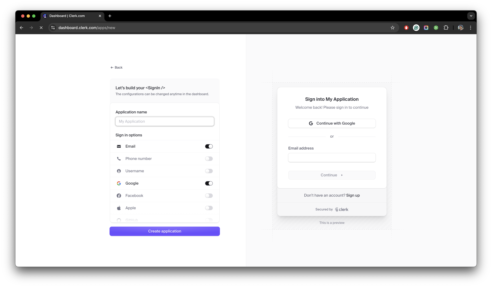

## Authentication

For authentication purposes, StudyStudio uses [Clerk](https://clerk.com/) to implement the backend for managing
sign-ups and sign-ins using multiple beautiful minimalists authentication pages. When running it locally, we are
using their test environment to self host it on our local machine.

To sign-in or sign-up, you will need to enter your email address or connect your google/facebook account and
follow the given steps.

import { Steps } from 'nextra/components'
 
<Steps>

### Create a Clerk Account

Navigate to the [Clerk Signin Page](https://clerk.com/) and sign up. Now you will be redirected to the Clerk dashboard.
This is where you need to click on `Create application`

<figure>
  <></>
  <figcaption>Clerk dashboard while creating a new application.</figcaption>
</figure>

### Creating an Application

Once you are on the process of creating an application, you will be asked to enter the name of the application and
select the appropriate sign-in/sign-up methods for your users. For this project, we are using the `Email`, `Google`,
and `Facebook` sign-in methods.

<figure>
  <></>
  <figcaption>Setting up a new application on clerk.</figcaption>
</figure>

### Setting up the Application

Afterwards, you will be redirected to the application settings page where you can find the `Publishable Key` and
`Secret Key`. You will need to copy these keys and paste them in the `.env.local` file in the root directory of the
project.

<figure>
  <></>
  <figcaption>Finding publishable and secret keys on the dashboard.</figcaption>
</figure>

### Replacing Clerk Publishable Key and Clerk Secret Key

Replace the `your-clerk-publishable-key` and `your-clerk-secret-key` with the keys provided in the Clerk dashboard.

```json filename=".env.local" copy
# CLERK (Authentication service)
NEXT_PUBLIC_CLERK_PUBLISHABLE_KEY = `Clerk Publishable Key`
CLERK_SECRET_KEY = ``Clerk Secret Key`
```

</Steps>

With this, you have successfully set up the authentication service for StudyStudio. Now you can move on to the next
section to set up the payment gateways.
