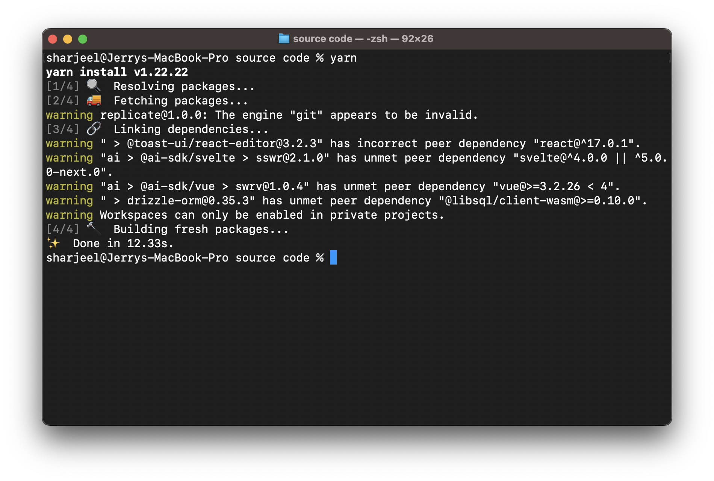

## Installing Dependencies

import { Callout } from "nextra/components";

<Callout type="info">
  We recommend using `yarn` for installing dependencies.
</Callout>

Once you purchase the code, move into the folder named `source code` and install the necessary dependencies,
make sure that you have `node/npm` or `yarn` installed in your system:

```json filename="Terminal" copy
cd "source code"
```

Depending upon your package manager, run the following commands:

import { Tabs } from "nextra/components";

{/* prettier-ignore */}
<Tabs items={["npm", "yarn"]} defaultIndex="0">
  <Tabs.Tab>
  ```json filename="Terminal" copy
   npm install 
   ```
   </Tabs.Tab>
  <Tabs.Tab >
   ```json filename="Terminal" copy
   yarn 
   ```
  </Tabs.Tab>
</Tabs>

This is how your terminal should look after installing the dependencies:

<figure>
  <></>
  <figcaption>
    Post installation of dependencies on a terminal window.
  </figcaption>
</figure>
