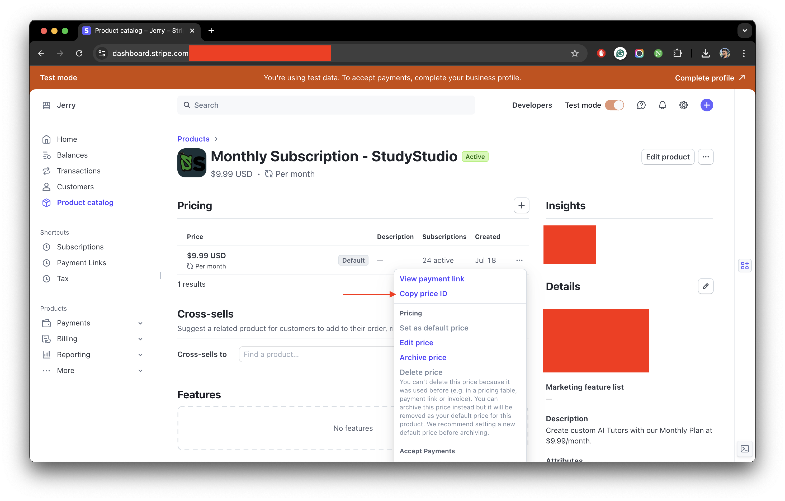

## Integrating Payment Gateways

import { Steps } from "nextra/components";
import { Callout } from "nextra/components";

Currently StudyStudio supports the following payment gateways:

- [Stripe](https://stripe.com/)
- [PayPal](https://www.paypal.com/)
- [Razorpay](https://razorpay.com/)

We will guide you through the process of integrating these payment gateways into your StudyStudio application.

### Stripe

The current setup for a subscription based system is a single `Monthly` plan. To enable Stripe billing, you
will need to fill out the following fields in your .env file:

<Steps>

### Replacing Secret Key

Replace `your-stripe-secret-key` with your original `Stripe Secret key` from [Stripe dashboard page](https://dashboard.stripe.com/).

### Replacing Webhook Secret

Replace `your-stripe-webhook-secret` with your original `Stripe Webhook Secret` from [Stripe webhook page](https://dashboard.stripe.com/webhooks)
by creating a new endpoint that points to the following URL: `your-app-url/api/stripe/webhook`. The webhook
should be listening for the following events:

- `checkout.session.completed`
- `customer.subscription.created`
- `customer.subscription.deleted`
- `customer.subscription.updated`
- `invoice.payment_succeeded`
- `invoice.payment_failed`

### Replacing Monthly Subscription Price ID

<Callout type="warning">
  Currently you can only offer a single subscription. Additional subscription
  plans will be added in the future.
</Callout>

Before you can replace `your-stripe-monthly-subscription-price-id`, you need to create a new price product from your
[Stripe product page](https://dashboard.stripe.com/products). On the product catalog, you will find the `Create product`
button. Click on it and fill out the necessary details. Select the `Recurring` option and set the `Billing interval`.
Afterwards, click on the `Add product` button. Now once created and you're on the `Product page`, click on the
three dots on the right side of the product and select `Copy price ID`.

This is the `Price ID` you need to replace `your-stripe-monthly-subscription-price-id` with.

```json filename=".env.local" copy
NEXT_PUBLIC_STRIPE_MONTHLY_SUBSCRIPTION_PRICE_ID = your-stripe-monthly-subscription-price-id
```

<figure>
  <></>
  <figcaption>Example for a monthly subscription product.</figcaption>
</figure>

</Steps>

### PayPal

To enable PayPal billing, you will need to perform the following steps:

<Steps>

<Callout type="info">
  Currently under development. Thank you for your patience.
</Callout>

{/* ### Login to PayPal

Login to your [PayPal account](https://developer.paypal.com/dashboard/) and create a new application to
get the `Client ID`.

### Creating A New Application

Select `Apps & Credentials`. New accounts come with a Default Application in the REST API apps section. To
create a new project, select `Create App`.

### Replacing PayPal Client ID

You only need the `PayPal Client ID`. No need for your client secret. Replace `your-paypal-client-id` with your
original `PayPal Client ID`. */}

</Steps>

### Razorpay

To enable Razorpay billing, you will need to perform the following steps:

<Steps>

<Callout type="info">
  Currently under development. Thank you for your patience.
</Callout>

{/* ### Login to Razorpay

Login to your [Razorpay account](https://dashboard.razorpay.com/signin?screen=sign_in) with the appropriate
credentials. Make sure `Live mode` is turned on.

### Navigate To Right Section

Navigate to `Account & Settings` → `API Keys` (under Website and app settings) → `Generate Key` to generate key for
the selected `Live mode`.

### Replacing Razorpay Key ID and Razorpay Key Secret

The `Key ID` and `Key Secret` should appear on a pop-up page. Replace `your-razorpay-key-id` with your original
`Razorpay Key ID` and `your-razorpay-key-secret` with your original `Razorpay Key Secret`. */}

</Steps>
