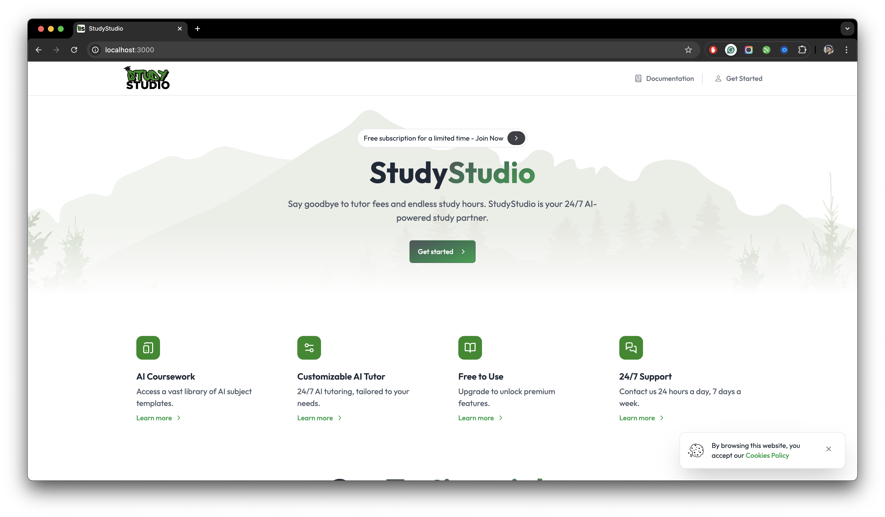

## Running StudyStudio

import { Callout } from "nextra/components";

<Callout type="warning">
  Please make sure that you have followed all of the previous steps and
  configured dependencies and services accordingly.
</Callout>

The moment you've been waiting for. Let's run StudyStudio locally. If you have followed all of the previous steps
correctly as mentioned in the documentation, you should be able to run StudyStudio locally without any issues. To run
StudyStudio locally, use the following command:

import { Tabs } from "nextra/components";

<Callout type="warning">
  Please make sure that you're using your preferred package manager. We still
  recommend using `yarn` for setting up your application.
</Callout>

{/* prettier-ignore */}
<Tabs items={["npm", "yarn"]} defaultIndex="0">
  <Tabs.Tab >
   ```json filename="Terminal" copy
   yarn dev
   ```
  </Tabs.Tab>
  <Tabs.Tab>
  ```json filename="Terminal" copy
   npm run dev
   ```
   </Tabs.Tab>
</Tabs>

This command will start the server and show a localized version of [StudyStudio](http://localhost:3000) running
in your browser.

<figure>
  <></>
  <figcaption>StudyStudio running locally on a local machine.</figcaption>
</figure>
