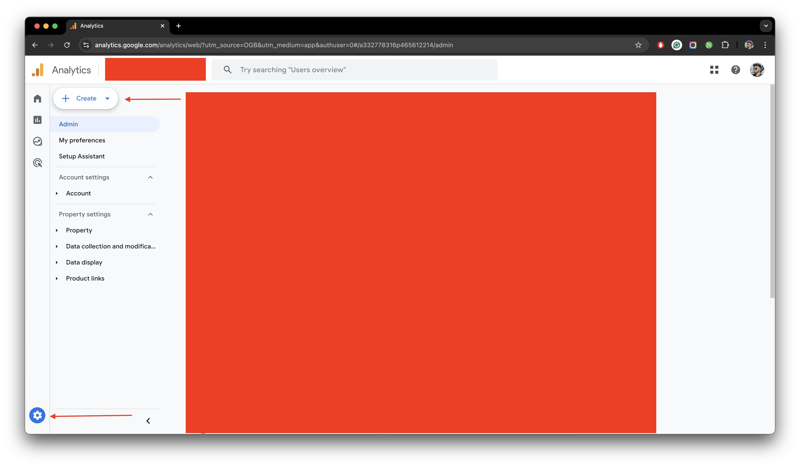
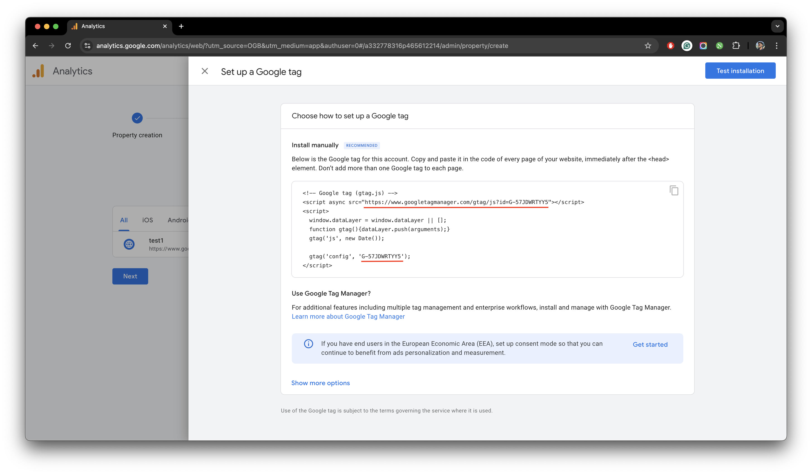

## Google Analytics

import { Callout } from "nextra/components";

<Callout type="warning">
  Please make sure that you already have a [Google
  Analytics](https://analytics.google.com/) account set up.
</Callout>

To add [Google Analytics](https://analytics.google.com/) with StudyStudio, you need to replace the following
environment variables in your `.env.local` file. This is the easiest way to get started with Google Analytics.
Just follow the following steps to ensure it works perfectly.

import { Steps } from 'nextra/components'
 
<Steps>

### Creating A Google Analytics Property

Go to your [Google Analytics](https://analytics.google.com/) account and click on the `Settings` icon from the sidebar.
Now click on the `Create Property` button to create a new property. Select `Propery` from the dropwdown.
Fill in the required details such as `Property Name`, `Business Details`, `Business Objectives` and click on the
`Create` button. Choose `Web` as the platform and enter your `Website URL` and `Stream Name`. Now click on the
`Create & Continue` button.

<figure>
  <></>
  <figcaption>
    A running window of a Google Analytics in a web browser.
  </figcaption>
</figure>

### Getting The Analytics ID

A new set up dialog box will appear. Make sure to select the `Install Manually` option. You will see a
tracking ID that you need to copy as shown in the image below.

<figure>
  <></>
  <figcaption>
    A running window of a Google Analytics account with dialog box for setup in
    a web browser.
  </figcaption>
</figure>

Copy both of the values and replace them in your `.env.local` file.

### Replacing Google Analytics ID

Replace `your-google-analytics-id-source-link` with your original `Complete src URL`, and `your-google-analytics-id-value`
with your original `ID Value` from the values provided by the dialog box.

```json filename=".env" copy
NEXT_PUBLIC_GOOGLE_ANALYTICS_ID = your-google-analytics-id-source-link
NEXT_PUBLIC_GOOGLE_ANALYTICS_ID_VALUE = your-google-analytics-id-value
```

</Steps>

Lastly, you can click on the `Test` button to ensure everything has been integrated and is working smoothly.
