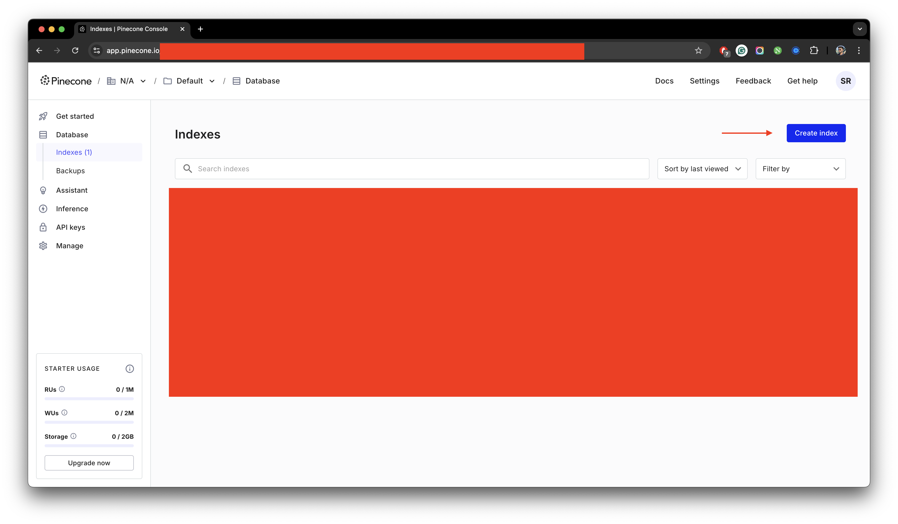
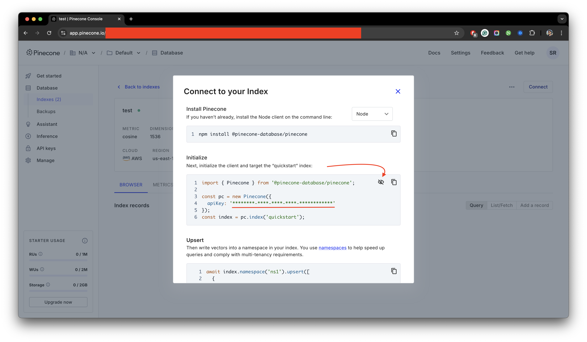
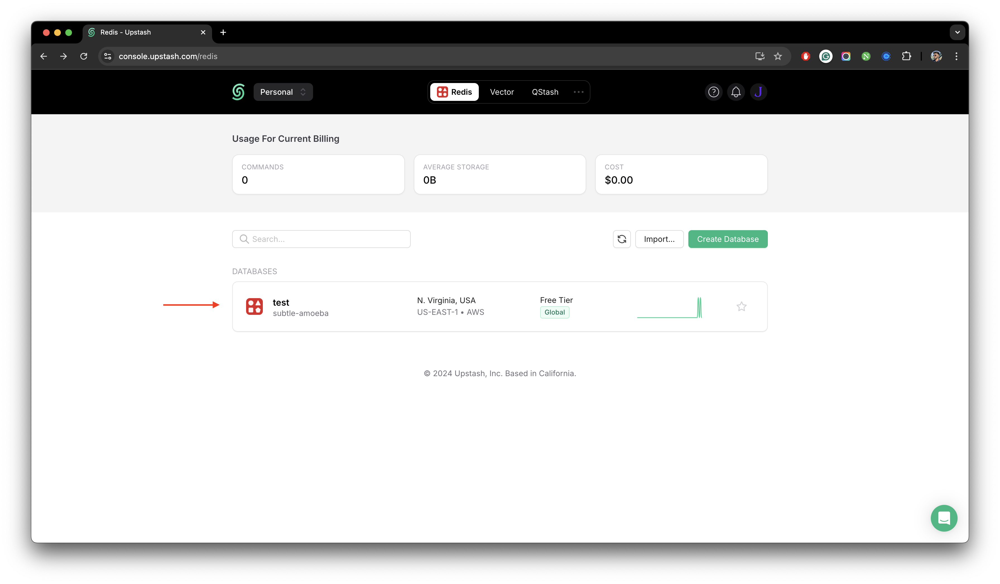
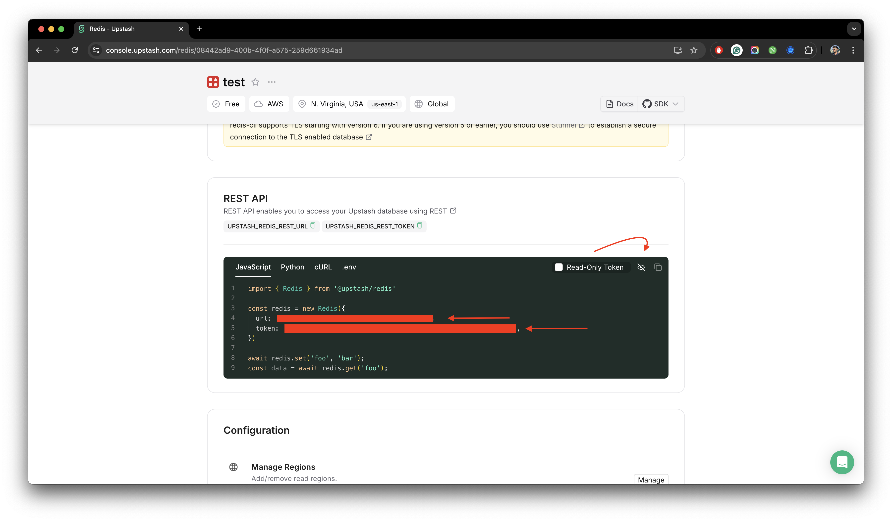

## Neon

import { Callout } from "nextra/components";

<Callout type="info">
  Neon is completely open-source. Personally, we're using Neon itself to host
  the database. The experience has been smooth with no issues. You can also use
  its self-hosting capabilities to host it on your own server or self-host it
  using their
  [documentation](https://percona.community/labs/serverless-postgresql/docs/installation/).
</Callout>

<Callout type="warning">
  Please make sure to follow all of the following steps and configure
  dependencies and services accordingly.
</Callout>

The database service used in StudyStudio is [Neon](https://neon.tech/). Neon is an open-source serverless Postgres
database platform for developers. You can self-host it or use their generous free-tier to host the database
on a serverless architecture without the need to pay for maintaining the database.

If you have followed our previous guide, then this step has already been configured properly. Additionally, we're
required to setup a storage service and some database services used for our AI modal. This step is quite significant
if you want your AI to be able to fine-tune and learn from the data.

### Pinecone

[Pinecone](https://www.pinecone.io/) is a cloud-based vector database for machine learning applications. By
representing data as vectors, Pinecone can quickly search for similar data points in a database. This makes it
essential for managing complex, scalable, and fast data retrieval. Want to build a real business, or settle for
pocket change? Real revenue needs the right tools.

To make sure, Pinecone is set up properly, follow the steps below:

import { Steps } from 'nextra/components'
 
<Steps>

### Setup Pinecone Account

Create an account on [Pinecone](https://www.pinecone.io/) and get your `Pinecone Index`. Click on `Create index`
and then set up your index name. It can be anything you want. Make sure the `Dimension` is set to `1536` and the
`Metric` is set to `cosine`. Click on `Create index`. You can keep the other details such as `Capacity mode`,
`Cloud provider`, and `Region` to be at default. Afterwards, click on `Create index` button.

<figure>
  <></>
  <figcaption>
    Example for the creation of an index on a pinecone dashboard.
  </figcaption>
</figure>

### Getting the Pinecone environment variables

Afterwards, you will be redirected to the `Index` you just created. Click on the `Connect` button and get your
`Pinecone API Key` from the `Initialize` section. Click on `Show API key`, copy it and save it for later use.

<figure>
  <></>
  <figcaption>
    Example for getting the api key of an index on a pinecone dashboard.
  </figcaption>
</figure>

### Replacing Pinecone Index, Pinecone Environment, and Pinecone API Key

Replace `your-pinecone-index` with your original `Pinecone Index Name`, `your-pinecone-environment` with either
`aws` or `gcp` depending upon your index configuration, and `your-pinecone-api-key` with your original
`Pinecone API Key` value that you copied earlier.

```json filename=".env.local" copy
PINECONE_INDEX = your-pinecone-index # your pinecone index name
PINECONE_ENVIRONMENT = "aws" # Options: 'aws', 'gcp'
PINECONE_API_KEY = your-pinecone-api-key
```

</Steps>

This completes the setup of Pinecone for your StudyStudio application.

### Upstash

[Upstash](https://upstash.com/) is a serverless Redis database that can be used to store and manage data. In our
use-case, it helps us control the number of requests, so everything runs smoothly without slowing down.
With its generous free tier, most users won’t see extra costs, even as usage grows.

To make sure, Upstash is set up properly, follow the steps below:

<Steps>

### Setup Upstash Account

Create an account on [Upstash](https://upstash.com/) and set it up properly. Click on `Create Database` and
then set up your database name. It can be anything you want. Make sure the `Plan` is set to `Free`. Click on
`Create Database`. You can keep the other details such as `Region` to be at default or the place that's most
close to your live location. Afterwards, click on `Create Database` button.

<figure>
  <></>
  <figcaption>
    Example after the post-creation of a database on an upstash dashboard.
  </figcaption>
</figure>

### Getting the Upstash environment variables

Afterwards, you will be redirected to the `Database` you just created. Scroll down until you see the `REST API`
section. From this section, you need to copy the `url`, and `token` of your database. Once copied, save them
for later use.

<figure>
  <></>
  <figcaption>
    Example for getting the environment variables of the database on an upstash
    dashboard.
  </figcaption>
</figure>

### Replacing Upstash Environment Variables

Replace `your-upstash-redis-rest-url` with your original `Upstash Redis Rest URL`, and `your-upstash-redis-rest-token`
with your original `Upstash Redis Rest Token` value that you copied earlier.

```json filename=".env.local" copy
UPSTASH_REDIS_REST_URL = your-upstash-redis-rest-url
UPSTASH_REDIS_REST_TOKEN = your-upstash-redis-rest-token
```

</Steps>

This completes the setup of Upstash for your StudyStudio application as well as the setup of the database services.
