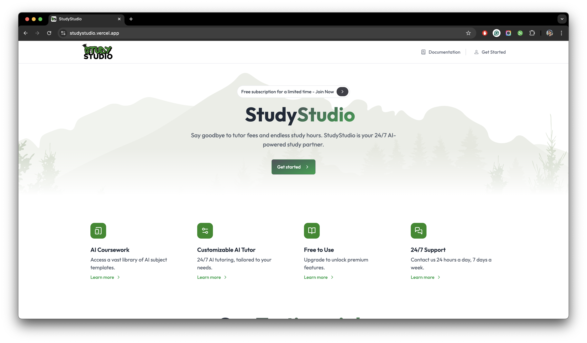

## Vercel Deployment

import { Callout } from "nextra/components";

<Callout type="warning">
  We're using Vercel to host our codebase. While it's possible to host it on any
  other platform, It's advisable to host it on Vercel for a seamless experience.
</Callout>

In this section, we will deploy StudyStudio to [Vercel](https://vercel.com/). Vercel provides the developer tools
and cloud infrastructure to build, scale, and secure a faster, more personalized web. It's hassle-free one click
deployment makes it a popular choice where you can deploy as many applications as you want for zero cost.

Before deploying StudyStudio to Vercel, Make sure that you have [Signed Up](https://vercel.com/signup) on Vercel.
For a much easier deployment process, you can do this using your GitHub account. Follow the given steps:

import { Steps } from 'nextra/components'
 
<Steps>

### Import Git Repository

On tha dashboard, click on the `Add New` button. A toolbar will appear. Click on the `Project` button.
Connect your GitHub account if you have'nt yet. You will be asked to select a Git repository. Select your project
repository from the list. Click on `Import` button. Select a project name and open the `Environment Variables` tab.
Make sure you have collected all of your environment variables before proceeding. Given below are the
environment variables that you must have when deploying this application. If they're not, you
might have missed a part in the guide. Copy all of your obtained values and paste them in the
`Environment Variables` tab.

<Callout type="info">
  You can copy and paste all of them at once. Once you have copied the keys with
  their values, just paste them in the `Key` field. The values will be
  automatically filled in the `Value` field.
</Callout>

```json filename=".env" copy
# CLERK (Authentication service)
NEXT_PUBLIC_CLERK_PUBLISHABLE_KEY = your-clerk-publishable-key
CLERK_SECRET_KEY = your-clerk-secret-key


# CLERK URLS
NEXT_PUBLIC_CLERK_SIGN_IN_URL = /sign-in
NEXT_PUBLIC_CLERK_SIGN_UP_URL = /sign-up


# GOOGLE GEMINI API KEY (AI service)
NEXT_PUBLIC_GOOGLE_GEMINI_API_KEY = your-google-gemini-api-key


# DRIZZLE & NEON (ORM & Database service)
NEXT_PUBLIC_DRIZZLE_DB_URL = your-neon-db-connection-string
DATABASE_URL = your-neon-db-connection-string


# CLOUDINARY (Image storage service)
NEXT_PUBLIC_CLOUDINARY_CLOUD_NAME = your-cloudinary-cloud-name
NEXT_PUBLIC_CLOUDINARY_UPLOAD_PRESET = your-cloudinary-upload-preset


# PINECONE (AI service)
PINECONE_INDEX = your-pinecone-index
PINECONE_ENVIRONMENT = "aws" # Options: 'aws', 'gcp'
PINECONE_API_KEY = your-pinecone-api-key


# UPSTASH (Redis service)
UPSTASH_REDIS_REST_URL = your-upstash-redis-rest-url
UPSTASH_REDIS_REST_TOKEN = your-upstash-redis-rest-token


# STRIPE (Payment service)
NEXT_PUBLIC_STRIPE_PUBLISHABLE_KEY = your-stripe-publishable-key
STRIPE_SECRET_KEY = your-stripe-secret-key
NEXT_PUBLIC_STRIPE_MONTHLY_SUBSCRIPTION_PRICE_ID = your-stripe-monthly-subscription-price-id


# PAYPAL VARS (Payment service)
NEXT_PUBLIC_PAYPAL_CLIENT_ID = your-paypal-client-id


# RAZORPAY VARS (Payment service)
NEXT_PUBLIC_RAZORPAY_KEY_ID = your-razorpay-key-id
RAZORPAY_KEY_SECRET = your-razorpay-key-secret


# GOOGLE ANALYTICS VARS
NEXT_PUBLIC_GOOGLE_ANALYTICS_ID = your-google-analytics-id
NEXT_PUBLIC_GOOGLE_ANALYTICS_ID_VALUE = your-google-analytics-id-value


# APP URL
NEXT_PUBLIC_APP_URL = http://localhost:3000 # Your app URL
NEXT_PUBLIC_APP_TEST_MODE = true # Set to true to enable test mode


# ADDITIONALS
VERCEL_DEEP_CLONE = true
```

Copy your original values as they are and paste them in the `Environment Variables` tab. Click on the
`Deploy` button.

<figure>
  <></>
  <figcaption>The deployment page on Vercel.</figcaption>
</figure>

</Steps>

Once the deployment is completed, you will see an instance of your app running like shown in the given figure.

<figure>
  <></>
  <figcaption>StudyStudio running in a live environment.</figcaption>
</figure>

StudyStudio is ready and fully functional to use now.
