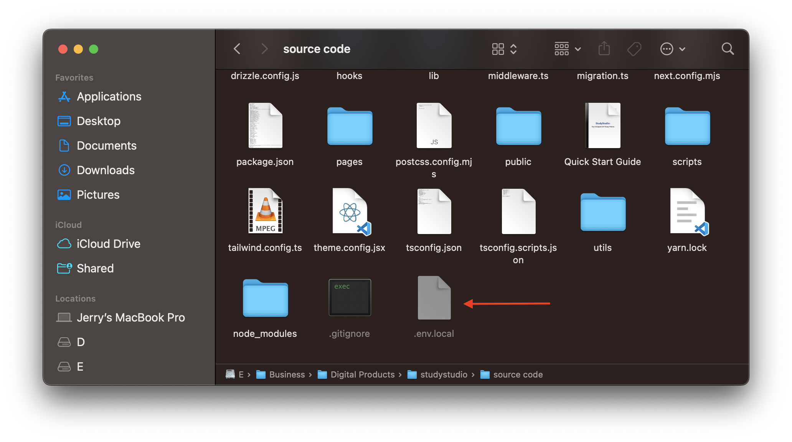

## Creating Environment Variables

You need to create an `.env.local` file in your project root directory and add the following environment variables:

```json filename=".env.local" copy
# CLERK (Authentication service)
NEXT_PUBLIC_CLERK_PUBLISHABLE_KEY = your-clerk-publishable-key
CLERK_SECRET_KEY = your-clerk-secret-key


# CLERK URLS
NEXT_PUBLIC_CLERK_SIGN_IN_URL = /sign-in
NEXT_PUBLIC_CLERK_SIGN_UP_URL = /sign-up


# GOOGLE GEMINI API KEY (AI service)
NEXT_PUBLIC_GOOGLE_GEMINI_API_KEY = your-google-gemini-api-key


# DRIZZLE & NEON (ORM & Database service)
NEXT_PUBLIC_DRIZZLE_DB_URL = your-neon-db-connection-string
DATABASE_URL = your-neon-db-connection-string


# CLOUDINARY (Image storage service)
NEXT_PUBLIC_CLOUDINARY_CLOUD_NAME = your-cloudinary-cloud-name
NEXT_PUBLIC_CLOUDINARY_UPLOAD_PRESET = your-cloudinary-upload-preset


# PINECONE (AI service)
PINECONE_INDEX = your-pinecone-index
PINECONE_ENVIRONMENT = "aws" # Options: 'aws', 'gcp'
PINECONE_API_KEY = your-pinecone-api-key


# UPSTASH (Redis service)
UPSTASH_REDIS_REST_URL = your-upstash-redis-rest-url
UPSTASH_REDIS_REST_TOKEN = your-upstash-redis-rest-token


# STRIPE (Payment service)
NEXT_PUBLIC_STRIPE_PUBLISHABLE_KEY = your-stripe-publishable-key
STRIPE_SECRET_KEY = your-stripe-secret-key
NEXT_PUBLIC_STRIPE_MONTHLY_SUBSCRIPTION_PRICE_ID = your-stripe-monthly-subscription-price-id


# PAYPAL VARS (Payment service)
NEXT_PUBLIC_PAYPAL_CLIENT_ID = your-paypal-client-id


# RAZORPAY VARS (Payment service)
NEXT_PUBLIC_RAZORPAY_KEY_ID = your-razorpay-key-id
RAZORPAY_KEY_SECRET = your-razorpay-key-secret


# GOOGLE ANALYTICS VARS
NEXT_PUBLIC_GOOGLE_ANALYTICS_ID = your-google-analytics-id
NEXT_PUBLIC_GOOGLE_ANALYTICS_ID_VALUE = your-google-analytics-id-value


# APP URL
NEXT_PUBLIC_APP_URL = http://localhost:3000 # Your app URL
NEXT_PUBLIC_APP_TEST_MODE = true # Set to true to enable test mode


# ADDITIONALS
VERCEL_DEEP_CLONE = true
```

This is how your project root directory should look after creating the .env.local file:

<figure>
  <></>
  <figcaption>
    Post creation of .env.local file in project root directory.
  </figcaption>
</figure>
