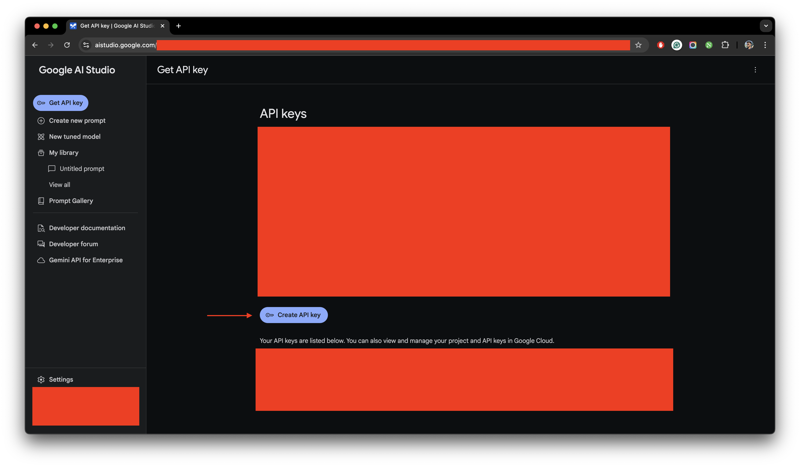

## Creating Google Developer Account

To use Gemini, you need to create an account on [Google AI](https://ai.google.dev/). Once you have created an account,
you can get your API key from the [API page](https://aistudio.google.com/app/). Afterwards in your .env file, you
need to make the following changes:

import { Steps } from 'nextra/components'
 
<Steps>
### Replacing API Key
 
Replace `your-gemini-api-key` with your original `Gemini API key` from [API page](https://aistudio.google.com/app/).

<figure>
  <></>
  <figcaption>
    A figure displaying how to create your own api key on Google AI Studio.
  </figcaption>
</figure>

</Steps>
