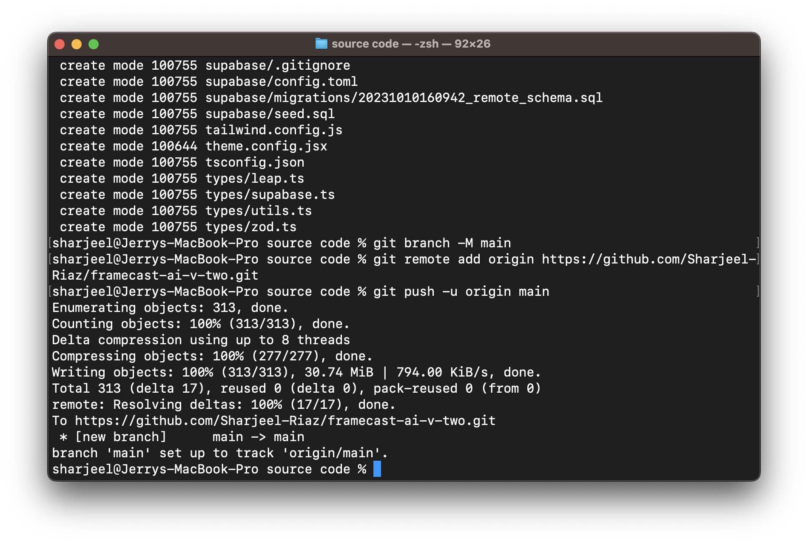

## Installing Git

To deploy StudyStudio to production, we're using [Git](https://git-scm.com/). A free and open-source distributed
version control system to handle our codebase and it's future updates in a more organized manner. Click here to
[Download Git](https://git-scm.com/downloads). Once you have downloaded Git & purchased the code, move into the
folder named `source code` using your terminal.

```json filename="Terminal" copy
cd "source code"
```

## Creating A GitHub Account

Head over to [GitHub](https://www.github.com) and create an account. GitHub is a platform that provides a space to
create and manage your remote code repositories. Once you have created an account, you can create a new repository
and name it whatever you like by navigating to the `Repositories` tab and clicking on the `New` button. For security
purposes, keep the repository `private`.

Now follow the steps given below:

import { Steps } from 'nextra/components'
 
<Steps>

### Initialize Git

In your terminal, enter the following command to initialize Git in your project:

```json filename="Terminal" copy
git init
```

### Pushing Code To GitHub

Add all files, and commit them to your remote repository by running the following commands one-by-one:

```json filename="Terminal" copy
git add .
```

```json filename="Terminal" copy
git commit -m "Any message you want to add e.g. Pushing code to GitHub"
```

Change the branch, add your remote origin referencing your remote repository, and push the codebase.

```json filename="Terminal" copy
git branch -M main
```

```json filename="Terminal" copy
git remote add origin (enter the link of your remote repository without brackets)
```

```json filename="Terminal" copy
git push -u origin main
```

</Steps>

This is how your terminal should look after following the guide and running these commands:

<figure>
  <></>
  <figcaption>
    Example on post pushing of a codebase on GitHub via Git as seen on a
    terminal window.
  </figcaption>
</figure>
