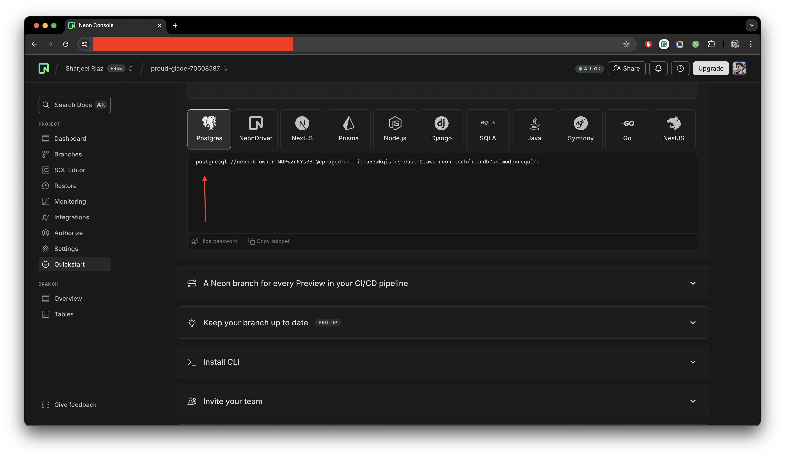

## Drizzle

import { Steps } from "nextra/components";
import { Callout } from "nextra/components";
import { Tabs } from "nextra/components";

[Drizzle](https://orm.drizzle.team/) is an open-source headless Typescript ORM. t’s the only ORM with both relational
and SQL-like query APIs, providing you the best of both worlds when it comes to accessing your relational data.

For `Production server environment`, we are using Drizzle in combination with [Neon](https://neon.tech/) which is also an
open-source `PostgreSQL` database.

In order to setup the Drizzle ORM, you need to follow the below steps:

<Steps>

### Setup project with Neon

Visit the [Neon](https://neon.tech/), sign-up, and create a new project. You will be asked to setup a `Name`, `Postgres version`,
`Cloud Service Provider`, `Region`, and `Compute size`. You can create your own database name or use the default one.
For the rest of the values, you can keep them at default. Moving onwards, you will be redirected to the `Quickstart`.
From the `Quickstart` section, select `Postgres`, click on `show password`, and copy the snippet.

<figure>
  <></>
  <figcaption>Example for a project created on Neon dashboard.</figcaption>
</figure>

### Replacing environment variables

Replace `your-neon-db-connection-string` with your original `Neon DB Connection String` from
[Neon dashboard](https://console.neon.tech/). You need to ensure you have used the same `Neon DB Connection String`
for all of the required environment variables.

```json filename=".env.local" copy
NEXT_PUBLIC_DRIZZLE_DB_URL = your-neon-db-connection-string
DATABASE_URL = your-neon-db-connection-string
```

### Visiting Drizzle Studio

You can use the following command to visit Drizzle studio for your project:

{/* prettier-ignore */}
<Tabs items={["npm", "yarn"]} defaultIndex="0">
  <Tabs.Tab>
  ```json filename="Terminal" copy
   npm db:studio 
   ```
   </Tabs.Tab>
  <Tabs.Tab >
   ```json filename="Terminal" copy
   yarn db:studio
   ```
  </Tabs.Tab>
</Tabs>

</Steps>

This completes your setup for Drizzle ORM with Neon database. You can now start using Drizzle ORM in your project.
