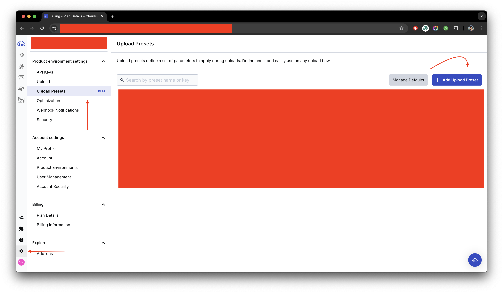

### Cloudinary

import { Callout } from "nextra/components";

The image storage service used in StudyStudio is [Cloudinary](https://cloudinary.com/). Cloudinary is a cloud-based
image and video management service. It enables users to upload, store, manage, manipulate, and deliver images and
video for websites and apps. You can use their free-tier to host the images and videos for your application.

<Callout type="default">
  If you're worried about the free-tier not being enough or the need to scale in
  the future, we have provided an approximate accurate cost estimate calculator
  for our SaaS product in the documentation as well. Visit [Cost
  Calculator](/documentation/cost-guide) to learn about it in depth.
</Callout>

Open your `.env.local` file and ensure following the given steps:

import { Steps } from 'nextra/components'
 
<Steps>

### Setup Cloudinary Account

Create an account on [Cloudinary](https://cloudinary.com/) and get your `Cloud Name`. You will see this value in
your Cloudinary dashboard. Copy it and save it for later use.

### Creating a Cloudinary Upload Preset

From the sidebar, navigate to the `Settings` tab and then click on the `Upload Presets` tab. Create a new upload
preset by clicking on `Add Upload Preset` button. Make sure your `Signing mode` is set to `Unsigned`.
You can keep the rest of the values to be at default and the `Upload Preset Name` field empty. Click on `Save`.
Once created, you can copy the `Upload Preset Name` that was generated by the system and save it for later use.

<figure>
  <></>
  <figcaption>
    Example for the creation of upload preset on a cloudinary dashboard.
  </figcaption>
</figure>

### Replacing Cloudinary Cloud Name and Cloudinary Upload Preset

Replace `your-cloudinary-cloud-name` with your original `Cloudinary Cloud Name`, and `your-cloudinary-upload-preset`
with your original `Cloudinary Upload Preset` values that you copied earlier.

```json filename=".env.local" copy
NEXT_PUBLIC_CLOUDINARY_CLOUD_NAME = your-cloudinary-cloud-name
NEXT_PUBLIC_CLOUDINARY_UPLOAD_PRESET = your-cloudinary-upload-preset
```

</Steps>

This is how you can set up Cloudinary for your StudyStudio application.
